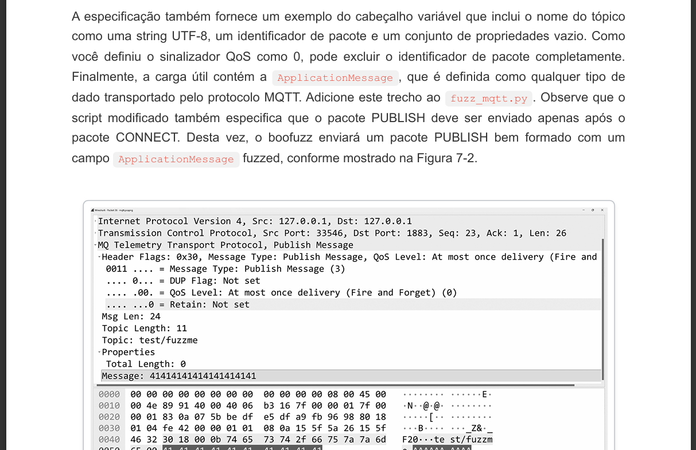

# OCRack

[](https://python.org)
[](LICENSE)
[](https://github.com/marcostolosa/OCRack)
[](https://openai.com)
[](https://github.com/PaddlePaddle/PaddleOCR)
[](https://playwright.dev)

Advanced PDF translation engine with OCR capabilities, intelligent chunking, and automated image extraction/reinsertion.

 


## Features

- **Default Behavior**: Automatic image extraction + translation + PDF generation
- **Smart Chunking**: Intelligent text segmentation for optimal translation context
- **Image Processing**: Automatic extraction and reinsertion with precise positioning
- **Cost Optimization**: Real-time cost tracking with OpenAI API caching support
- **Rich UI**: Professional terminal interface with detailed progress tracking
- **Robust Pipeline**: Error handling, retries, and checkpoint recovery

## Installation

```bash
git clone https://github.com/marcostolosa/OCRack.git
cd OCRack
pip install -e .
```

### Dependencies

```bash
# Core dependencies (installed automatically)
pip install -r requirements.txt

# Playwright browser engine
playwright install chromium

# External programs (install separately)
# - Pandoc: https://pandoc.org/installing.html (fallback only)
# - Tesseract OCR: https://github.com/tesseract-ocr/tesseract (fallback only)
```
## Demo

*Original*

*Traduzido*




## Usage

### Basic Commands

```bash
# Default: Extract images + translate + generate PDF
ocrack document.pdf -p "234-235"

# Skip image extraction
ocrack document.pdf -p "234-235" --no-ocr

# Terminal output only (no PDF)
ocrack document.pdf -p "234-235" --cli
```

### Advanced Usage

```bash
# Page range translation
ocrack input.pdf --pages "10-28"

# Chapter-based translation  
ocrack input.pdf -c "1,3-5"

# High-quality model
ocrack input.pdf --pages "10-28" -m gpt-4o

# Cost control
ocrack input.pdf -c "1-10" --max-chunks 50
```

### Command Reference

| Flag | Description |
|------|-------------|
| `-p, --pages "X-Y"` | Translate specific page range |
| `--no-ocr` | Disable image extraction |
| `--cli` | Terminal output (skip PDF generation) |
| `-c "1,3-5"` | Translate specific chapters |
| `-m MODEL` | OpenAI model (default: gpt-4o-mini) |
| `-o DIR` | Output directory |

## Architecture

### Processing Pipeline

1. **PDF Analysis** - Document structure and metadata extraction
2. **Image Extraction** - Page-specific image harvesting with coordinates
3. **Text Extraction** - Layout-aware text processing with OCR fallback
4. **Smart Chunking** - Context-preserving text segmentation
5. **AI Translation** - OpenAI GPT-powered EN→PT-BR translation
6. **Document Assembly** - HTML compilation with embedded images
7. **PDF Generation** - Playwright-based PDF creation with syntax highlighting

### Core Components

- **OCR Engine**: PaddleOCR (primary), Tesseract (fallback)
- **PDF Renderer**: Playwright (primary), markdown-pdf (fallback)  
- **Translation**: OpenAI GPT models with technical prompt engineering
- **Image Processing**: Base64 embedding for reliable rendering
- **Syntax Highlighting**: Automatic language detection with Pygments

## Configuration

### Environment Variables

```bash
export OPENAI_API_KEY="sk-..."
export OPENAI_MODEL="gpt-4o-mini"  # optional
export OPENAI_BASE_URL="..."       # optional
```

### Output Structure

```
project/
├── out/                       # Default output directory
│   ├── document_translated_YYYYMMDD_HHMMSS.pdf
│   ├── document_translated_YYYYMMDD_HHMMSS.html  # debug
│   └── img_manifest/          # Extracted images
│       ├── manifest.json      # Image metadata
│       └── page_XXX_img_XX.png
└── logs/
    └── translate_YYYYMMDD_HHMMSS.log
```

## Technical Specifications

### Dependencies

**Core Libraries:**
- `openai>=1.0.0` - API client
- `rich>=13.0.0` - Terminal UI
- `PyMuPDF>=1.23.0` - PDF processing

**PDF Processing:**
- `pdfplumber>=0.7.0` - Text extraction
- `playwright>=1.40.0` - HTML to PDF rendering
- `markdown>=3.4.0` - HTML generation

**OCR Stack:**
- `paddleocr>=2.8.0` - Primary OCR engine
- `paddlepaddle>=2.6.0` - ML framework
- `pytesseract>=0.3.10` - Fallback OCR

**Image Processing:**
- `Pillow>=9.0.0` - Image manipulation
- `opencv-python>=4.8.0` - Computer vision

### Performance Metrics

- **Typical Speed**: 1-5 pages/minute (depends on content complexity)
- **Cost (gpt-4o-mini)**: $0.001-0.01 per page
- **Memory Usage**: ~500MB baseline + 50MB per concurrent translation
- **Cache Efficiency**: Up to 50% cost reduction on repeated content

## Batch Processing

```bash
# Multiple page ranges
for pages in "1-50" "51-100" "101-150"; do
    ocrack document.pdf --pages "$pages" -o "batch_$pages"
done

# Chapter processing with cost limits
ocrack technical_manual.pdf -c "1-20" --max-chunks 100 -m gpt-4o
```

## Troubleshooting

### Common Issues

**Images not rendering in PDF:**
- Verify Playwright installation: `playwright install chromium`
- Check image extraction: `ls out/img_manifest/`

**OCR quality issues:**
- Install PaddleOCR models: automatic on first run
- Fallback to Tesseract: requires separate installation

**Translation failures:**
- Verify OpenAI API key: `echo $OPENAI_API_KEY`
- Check API limits and billing
- Reduce chunk size with `--max-chunks`

### Debug Mode

```bash
# Enable verbose logging
ocrack document.pdf -p "1-10" --debug

# Keep HTML output for inspection
ocrack document.pdf -p "1-10" --keep-html
```

## License

MIT License

---

**Warning**: This tool processes potentially sensitive documents. Ensure compliance with data protection regulations when using cloud-based translation services.